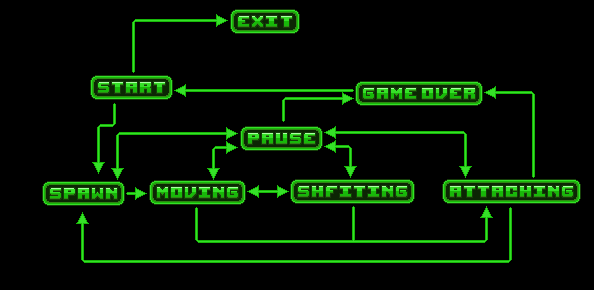
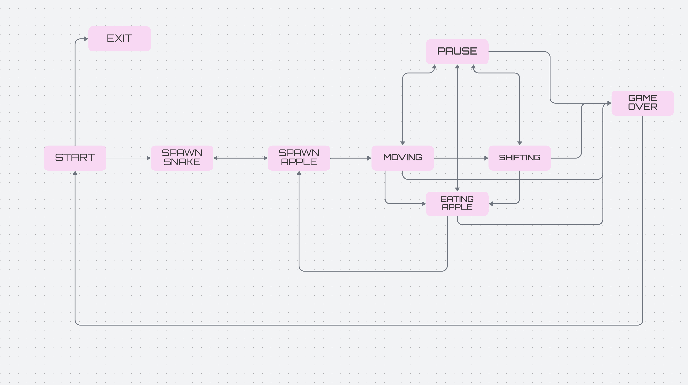

# BrickGame 

## Tetris

- Для формализации логики игры использован представленный ниже конечный автомат:

  - Start — состояние, в котором игра ждет в главном меню, пока игрок нажмет на кнопку старта игры или выхода из игры.
  - Pause - состояние, в котором игра останавливается, переходит в меню и ждет пока игрок нажмет на кнопку продолжения игры или выхода в главное меню.
  - Spawn — состояние, в которое переходит игра при создании очередного блока и выбора следующего блока для спавна.
  - Moving — основное игровое состояние с обработкой ввода от пользователя — поворот блоков/перемещение блоков по горизонтали.
  - Shifting — состояние, в которое переходит игра после истечения таймера. В нем текущий блок перемещается вниз на один уровень.
  - Attaching — состояние, в которое преходит игра после «соприкосновения» текущего блока с уже упавшими или с землей. Если образуются заполненные линии, то она уничтожается и остальные блоки смещаются вниз. Если блок остановился в самом верхнем ряду, то игра переходит в состояние «Game over».
  - Game over — игра окончена и переход в главное меню.
  - Exit - игрок выходит из игры

### Механники игры:
  - Вращение фигур;
  - Перемещение фигуры по горизонтали;
  - Ускорение падения фигуры (при нажатии кнопки фигура перемещается до конца вниз);
  - Показ следующей фигуры;
  - Уничтожение заполненных линий;
  - Завершение игры при достижении верхней границы игрового поля;
  - В игре присутствуют все виды фигур, показанных на картинке ниже.

  #### Управление.
  
    - "P" - Пауза ,
    - Стрелка влево или "A" — движение фигуры влево,
    - Стрелка вправо или "D" — движение фигуры вправо,
    - Стрелка вниз или "S" — падение фигуры,
    - Стрелка вверх или "W" — ни используется в данной игре,
    - Пробел - действие (вращение фигуры).

  Управление поддерживается на английской раскладке!!!

### Подсчет очков и рекорд в игре Тетрис

  Добавлены в игру следующие механики:

- подсчет очков;
- хранение максимального количества очков.

Данная информация передается и выводится пользовательским интерфейсом в боковой панели. Максимальное количество очков хранится в файле "record_scope.txt" и сохраняется между запусками программы.

Максимальное количество очков изменяется во время игры, если пользователь во время игры превышает текущий показатель максимального количества набранных очков.

Начисление очков происходит следующим образом:

- 1 линия — 100 очков;
- 2 линии — 300 очков;
- 3 линии — 700 очков;
- 4 линии — 1500 очков.

### Часть 3. Механика уровней в Тетрисе

Добавьлена в игру механика уровней. Каждый раз, когда игрок набирает 600 очков, уровень увеличивается на 1. Повышение уровня увеличивает скорость движения фигур. Максимальное количество уровней — 10.

## Змейка
В данном проекте реализована игру «Змейка» на языке программирования С++ в парадигме объектно-ориентированного программирования.

### Введение

Реализация игры «Змейка» состоит из двух отдельных компонентов: библиотеки, отвечающей за реализацию логики игры, и десктопного графического интерфейса.

Разработанная библиотека подключена к консольному интерфейсу из BrickGame v1.0. Консольный интерфейс полностью поддерживает новую игру.

Разработанная в BrickGame v1.0 игра «Тетрис» подключена к десктопному интерфейсу, разработанному в данном проекте.## Требования к проекту

## Требования к проекту

### Общая информация

- Программа разработана на языке C++ стандарта C++17.
- Программа состоит из двух частей: библиотеки, реализующей логику игры змейка, и десктопного интерфейса.
- Для формализации логики игры использован конечный автомат.
- Код библиотеки программы находится в папке src/brick_game/snake.
- Код с интерфейсом программы находится в папке src/gui/desktop.
- Классы реализованы внутри пространства имен `s21`.
- Библиотека, реализующая логику игры, покрыта unit-тестам.
- Реализация с графическим пользовательским интерфейсом, на базе Qt для C++17.
- Программа реализована с использованием паттерна MVC.
- Начальная длина змейки равна четырем «пикселям».
- Игровое поле имеет размер 10 «пикселей» в ширину и 20 «пикселей» в высоту.

### Механика игры

- Змейка передвигатся по полю самостоятельно, на один блок вперед по истечении игрового таймера.
- Когда змейка сталкивается с «яблоком», ее длина увеличивается на один.
- Когда длина змейки достигает 200 единиц, игра заканчивается победой игрока.
- Когда змейка сталкивается с границей поля или сама с собой, игра заканчивается поражением игрока.
- Пользователь может менять направление движение змейки с помощью стрелок, при этом змейка может поворачивать только налево и направо относительно текущего направления движения.
- Пользователь может ускорять движение змейки зажатием клавиши действие.
- Подсчет очков (при поедании очередного «яблока» добавляется одно очко.).
- Хранение максимального количества очков (максимальное количество изменятся во время игры, если пользователь во время игры превышает текущий показатель максимального количества набранных очков).
- Каждый раз, когда игрок набирает 5 очков, уровень увеличивается на 1. Повышение уровня увеличивает скорость движения змейки. Максимальное количество уровней — 10.

### Конечный автомат

### Управление в игре

Для управления в игре используюся следующие клавиши:
- "Стрелка вверх" для движения змейки вврех;
- "Стрелка вниз" для движения змейки вниз;
- "Стрелка вправо" для движения змейки вправо;
- "Стрелка влево" для движения змейки влево;
- "Пробел" для ускорения движения;
- "Esc" для паузы игры;
